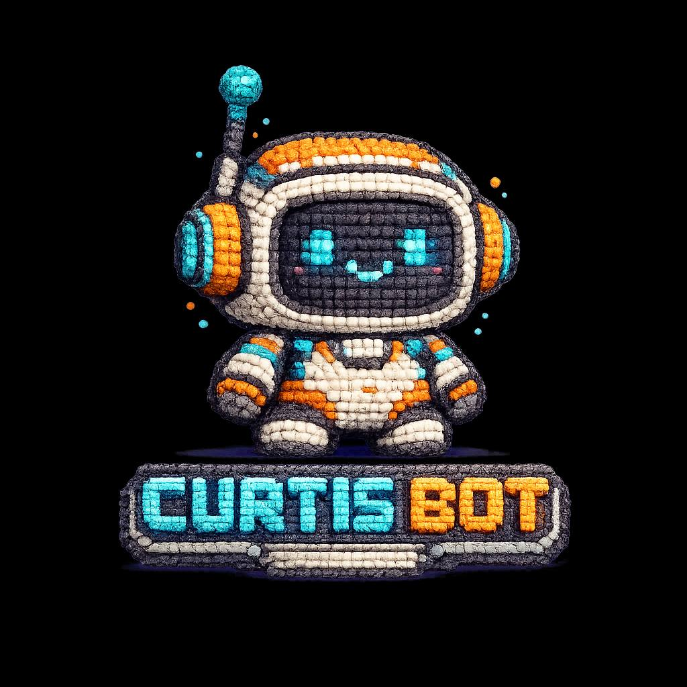

<p align="center">
  
</p>

# Curtis Bot

**AI Agent Gateway** — Bridge your phone to Claude Code, Kimi, and other AI coding CLIs through OpenClaw.

Curtis Bot turns your Linux machine into a personal AI operating system. Text from your phone, and a full-powered coding agent responds — reading files, writing code, running builds, managing deployments, and monitoring services.

## What It Does

```
Phone (Telegram/SMS) → OpenClaw Gateway → Claude Code / Kimi CLI → Your Machine
```

- **Text-to-code**: Message from your phone, get full coding sessions
- **Multi-agent orchestration**: Spawn Claude Code and Kimi in parallel on different tasks
- **Cron monitoring**: Automated health checks on running services (e.g. trading bots)
- **File transfers**: Send/receive files via LocalSend between devices
- **Skill system**: Extensible plugins for GitHub, Discord, 1Password, weather, and 50+ more
- **Git operations**: Create repos, push code, open PRs — all from your phone

## Architecture

```
┌─────────────┐     ┌──────────────────┐     ┌─────────────────┐
│  Your Phone │────▶│  OpenClaw Gateway │────▶│  Claude Code CLI │
│  (Telegram) │     │  (Port 19000)     │     │  (opus-4-6)      │
└─────────────┘     │                   │────▶│  Kimi CLI        │
                    │  Skills / Cron /  │     │  (kimi-1.12)     │
                    │  MCP / Channels   │     └─────────────────┘
                    └──────────────────┘              │
                             │                        ▼
                    ┌────────┴────────┐     ┌─────────────────┐
                    │  LocalSend      │     │  Your Codebase   │
                    │  GitHub (gh)    │     │  Git repos       │
                    │  1Password (op) │     │  Running services│
                    │  Discord        │     │  Deployments     │
                    └─────────────────┘     └─────────────────┘
```

## Quick Start

See [SETUP.md](SETUP.md) for full installation guide.

```bash
# 1. Install OpenClaw
curl -fsSL https://get.openclaw.com | bash

# 2. Install Claude Code
npm install -g @anthropic-ai/claude-code

# 3. Configure the gateway
openclaw configure

# 4. Connect your phone channel (Telegram, SMS, etc.)
openclaw channels add telegram

# 5. Start the gateway
openclaw gateway start
```

## Features

### Phone-to-AI Bridge
Text from anywhere. Your message hits the OpenClaw gateway, which routes it to Claude Code running on your machine. Full coding agent access from your pocket.

### Multi-Agent Orchestration
Spawn multiple AI agents in parallel:
- Claude Code handles frontend while Kimi handles backend
- One agent writes code, another writes tests
- Project manager agent (you or the gateway) coordinates

### Cron Jobs & Monitoring
Set up automated checks that run on schedule:
```bash
openclaw cron add --name "Health Check" --interval 7200000 --prompt "Check service status"
```

### Skill System
52 skills available, covering:
- **Dev tools**: GitHub, Git, coding agents
- **Communication**: Discord, Slack, Telegram, WhatsApp
- **Productivity**: 1Password, Notion, Obsidian, Trello
- **Media**: Video frames, image gen, TTS, Whisper
- **Hardware**: Hue lights, Sonos, Eight Sleep, cameras

### File Transfers
Send files between your phone and machine via LocalSend:
```bash
# Receive files
localsend-cli receive --save-dir ~/incoming -y

# Send files
localsend-cli send --to "My Phone" ./build.zip
```

## Example Workflows

### Deploy a Website from Your Phone
```
You: "Deploy the new portfolio to iaiaia.dev"
Curtis: Extracts zip → builds Next.js → deploys to server → confirms live
```

### Monitor a Trading Bot
```
You: "Check pmbot status"
Curtis: Queries operator brief → analyzes PnL → reports health → auto-corrects if needed
```

### Spawn Parallel Agents
```
You: "Have Claude refactor the API while Kimi writes integration tests"
Curtis: Spawns both agents → monitors progress → reports results
```

### Git Operations
```
You: "Push the portfolio to GitHub"
Curtis: git init → create repo → commit → push → returns repo URL
```

## Tech Stack

| Component | Tool | Purpose |
|-----------|------|---------|
| Gateway | OpenClaw | Message routing, skills, cron, channels |
| Coding Agent | Claude Code (Opus 4.6) | File editing, builds, git, debugging |
| Coding Agent | Kimi CLI | Alternative/parallel coding agent |
| Runtime | Node.js 25 + Bun 1.3 + Python 3.14 | Multi-runtime support |
| Auth | 1Password CLI (op) | Secrets management |
| Version Control | Git + GitHub CLI (gh) | Repos, PRs, issues |
| File Transfer | LocalSend CLI | Cross-device file sharing |
| Web Server | Caddy | Static site serving |
| Tunnel | Cloudflare (cloudflared) | HTTPS routing to localhost |
| Containerization | Docker | Service isolation |

## Requirements

- Linux (tested on Arch/omarchy)
- Node.js 18+
- An Anthropic API key (for Claude Code)
- OpenClaw account
- A messaging channel (Telegram recommended)

## Documentation

- [Setup Guide](SETUP.md) — Full installation and configuration
- [Architecture](docs/architecture.md) — How the system works under the hood
- [LLM Integration](docs/llm-integration.md) — Connecting and using AI coding CLIs
- [Skills Reference](docs/skills.md) — Available skills and how to use them
- [Cron Jobs](docs/cron.md) — Setting up automated monitoring

## License

MIT

## Author

**Rami Ghalayini** — [@Chordlini](https://github.com/Chordlini)

Built with [OpenClaw](https://openclaw.com) + [Claude Code](https://claude.ai/claude-code)
